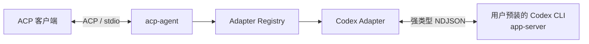

# acp-go

`acp-go` 是一个使用 Go 实现的 [Agent Client Protocol（ACP）](https://agentclientprotocol.com/) stdio Agent 服务。它通过可选择的 Adapter，把 ACP 客户端请求转交给具体的 Agent 运行时，并将运行时事件映射回统一的 ACP 会话、内容和工具调用模型。

当前 V1 提供 Codex Adapter：进程会启动用户本机已安装的 [OpenAI Codex CLI](https://github.com/openai/codex) `app-server`，在 ACP 客户端与 Codex 之间完成协议和生命周期适配。

> 项目目前处于 V1 阶段，默认且唯一注册的 Adapter 是 `codex`。

## 特性

- 基于 `github.com/coder/acp-go-sdk` 提供标准 ACP stdio 服务，协议输出与诊断日志严格分离。
- 使用显式 Adapter 注册表组织实现，启动时可通过 `--adapter` 选择，未知 Adapter 会在建立协议连接前失败。
- 支持 Codex 会话的新建、恢复、加载、关闭，多轮 Prompt、取消和 `_session/steering`。
- 支持文本、图片、嵌入上下文和资源链接输入。
- 支持 ChatGPT 浏览器登录与 API Key 认证，并避免在日志和错误中泄露凭据。
- 支持模型、推理强度以及 `read-only`、`agent`、`agent-full-access` 三种运行模式。
- 映射消息、推理、计划、Token Usage、命令、文件变更、MCP 工具和终端输出事件。
- 映射命令执行、文件变更和细粒度权限审批；取消、异常或过期请求默认拒绝。
- 使用固定 Schema 生成强类型 Codex app-server DTO，并提供可重复的协议新鲜度检查。

Codex Adapter 的实现边界、调用链和维护约束见 [`internal/codex/README.md`](internal/codex/README.md)。

## 架构



`acp-agent` 只在 `stdout` 读写 ACP 协议帧，启动错误、版本警告和 Codex 诊断信息统一写入 `stderr`，避免污染协议流。

## 快速开始

### 环境要求

- Go `1.25.8`，以 [`go.mod`](go.mod) 为准。
- 用户自行安装的 Codex CLI。当前 Adapter 的验证基线是 `0.148.0`；其他可识别版本会输出兼容性警告，然后继续尝试启动。
- 仅在刷新或重新生成 Codex 协议类型时需要 Node.js 与 npm；构建和运行已提交代码不依赖它们。

先确认 Codex 可执行且能输出版本：

```sh
codex --version
```

然后构建 Agent：

```sh
git clone https://github.com/JieWaZi/acp-go.git
cd acp-go
go build -o ./acp-agent ./cmd/acp-agent
```

`acp-agent` 由 ACP 客户端作为子进程启动，并通过 stdin/stdout 通信。直接运行下面的命令时，进程会等待客户端发送协议输入：

```sh
./acp-agent --adapter codex
```

`codex` 是默认 Adapter，因此也可以省略 `--adapter codex`。

不同 ACP 客户端的配置格式并不完全相同，核心启动信息如下：

```json
{
  "command": "/absolute/path/to/acp-go/acp-agent",
  "args": ["--adapter", "codex"],
  "env": {
    "CODEX_PATH": "/absolute/path/to/codex"
  }
}
```

如果 `codex` 已在客户端进程的 `PATH` 中，可以不设置 `CODEX_PATH`。

## 运行时配置

| 环境变量 | 作用 |
| --- | --- |
| `CODEX_PATH` | 指定 Codex 可执行文件。非空时只使用该路径，路径无效不会回退到 `PATH`；未设置时才从 `PATH` 查找 `codex`。 |
| `CODEX_API_KEY` | API Key 认证使用的首选环境变量。 |
| `OPENAI_API_KEY` | `CODEX_API_KEY` 未设置时使用的后备 API Key。 |
| `NO_BROWSER` | 任意非空值都会隐藏 ChatGPT 浏览器认证入口，适合无图形界面的运行环境。 |

API Key 的完整选择顺序是：ACP 认证请求中的 `_meta.api-key.apiKey`、`CODEX_API_KEY`、`OPENAI_API_KEY`。

## 项目结构

| 路径 | 职责 |
| --- | --- |
| [`cmd/acp-agent`](cmd/acp-agent) | 命令行入口、进程 stdio 边界和 Adapter 组合根。 |
| [`internal/acpserver`](internal/acpserver) | 使用 ACP SDK 建立 Agent 侧连接，并管理 Adapter 的有界关闭。 |
| [`internal/core`](internal/core) | 与具体实现无关的 Adapter 注册和选择。 |
| [`internal/codex`](internal/codex) | Codex app-server 到 ACP 的运行时适配。 |
| [`agents/codex/protocol`](agents/codex/protocol) | Codex app-server Schema、生成 DTO 和受控 Envelope。 |
| [`tools/protocolgen`](tools/protocolgen) | 固定工具链下的协议生成、新鲜度和稳定面检查。 |
| [`UPSTREAM.md`](UPSTREAM.md) | 上游版本、源码映射、Fixture 对照和已知差异。 |
| [`docs/V1_TEST_MATRIX.md`](docs/V1_TEST_MATRIX.md) | V1 能力对应的默认测试与真实 Codex 测试矩阵。 |

## 开发与验证

默认测试使用可控的 fake app-server，不需要账号凭据，也不会产生模型费用：

```sh
go test ./... -count=1 -timeout=300s
go vet ./...
go run ./tools/protocolgen --check
```

涉及并发、生命周期或协议边界的变更，还应运行竞态检查：

```sh
go test -race -p=1 ./... -count=1 -timeout=600s
```

真实 Codex Smoke Test 和完整 V1 场景是显式开启的付费/本机状态测试，运行方式和安全边界见 [`docs/V1_TEST_MATRIX.md`](docs/V1_TEST_MATRIX.md)。

## 协议同步

Codex app-server 的稳定 Schema、生成工具和参考实现版本均已固定。不要手工修改 `agents/codex/protocol/generated_protocol.go`。

```sh
# 从已提交 Schema 重新生成 Go 类型
go generate ./agents/codex/protocol

# 检查已提交产物是否与固定输入一致
go run ./tools/protocolgen --check

# 刷新 Codex Schema 并重新生成；需要 Node.js/npm
go run ./tools/protocolgen --refresh-schema
```

升级上游或扩大 V1 协议面前，请先阅读 [`UPSTREAM.md`](UPSTREAM.md)，并同步更新源码映射、Fixture 证据和测试。

## V1 边界

- 当前只注册 `codex` Adapter，但注册表和进程入口允许后续显式增加其他实现。
- 项目不捆绑、下载或自动安装 Codex CLI。
- `session/list` 和 Audio 输入尚未实现。
- V1 会映射 Codex 已产生的 MCP 工具事件，但不负责管理客户端提供的 MCP Server。
