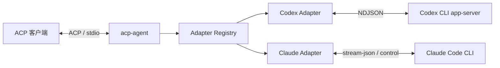

# acp-go

`acp-go` 是一个使用 Go 实现的 [Agent Client Protocol（ACP）](https://agentclientprotocol.com/) Agent 服务。它通过标准输入输出连接 ACP 客户端，并把会话请求交给用户本机安装的 Codex、Claude、Kimi、Cursor CLI 或 Pi CLI。

项目同时提供可直接嵌入其他 Go 程序的公开包：

- `github.com/JieWaZi/acp-go/pkg/acpserver`
- `github.com/JieWaZi/acp-go/pkg/acpmeta`
- `github.com/JieWaZi/acp-go/pkg/codex`
- `github.com/JieWaZi/acp-go/pkg/claude`
- `github.com/JieWaZi/acp-go/pkg/kimi`
- `github.com/JieWaZi/acp-go/pkg/cursor`
- `github.com/JieWaZi/acp-go/pkg/pi`
- `github.com/JieWaZi/acp-go/pkg/nativeacp`

## 适配器

| 适配器 | 启动方式 | 运行模型 | 主要能力 |
| --- | --- | --- | --- |
| Codex | 默认，或 `--adapter codex` | 一个 Adapter 持有一个 `codex app-server` 进程 | 认证、会话恢复、附加目录/Skills、Prompt Usage、取消、steering、标准文件 diff、工具、审批、MCP、Elicitation、模型与运行模式 |
| Claude | `--adapter claude` | 每个 ACP Session 持有一个 `claude` stream-json 进程 | 会话恢复、FIFO Prompt、取消、steering、Edit/Write 标准文件 diff、工具、权限、AskUserQuestion、MCP、模型、effort、fast 与权限模式 |
| Kimi | `--adapter kimi` | 复用 `kimi acp` 原生服务 | 原生模型目录（含旧 models）、会话、消息、三档权限、统一问答与 MCP |
| Cursor | `--adapter cursor` | 复用 `cursor-agent acp`，默认命令缺失时尝试 `agent acp` | 原生会话、模型、MCP、审批、提问与计划/待办投影 |
| Pi | `--adapter pi` | Go 移植 pi-acp，直连 `pi --mode rpc` | Pi 模型、思考、会话、三档权限、AskUserQuestion 与 MCP |

Codex 是默认适配器。其他适配器只有被显式选择时才启动。Kimi、Cursor 复用 Go ACP SDK 连接原生 ACP；Pi 在 Go 内部适配官方 RPC；来源与能力边界见 [原生 ACP 说明](pkg/nativeacp/README.md)。



## 环境要求

- Go 版本以 [`go.mod`](go.mod) 为准。
- 使用 Codex Adapter 时，需要安装并登录 [Codex CLI](https://github.com/openai/codex)。
- 使用 Claude Adapter 时，需要安装并登录 [Claude Code CLI](https://docs.anthropic.com/en/docs/claude-code)。
- 构建 Go 程序不需要 Node.js；运行 Pi 适配器需要它自己的 Node.js 与 Pi 环境，见 [Pi 说明](pkg/pi/README.md)。刷新 Codex 协议类型也需要对应工具链。

本项目不会下载、更新 CLI，也不会修改用户的登录状态。

## 安装

从源码构建：

```sh
git clone https://github.com/JieWaZi/acp-go.git
cd acp-go
go build -o ./acp-agent ./cmd/acp-agent
```

发布构建可把版本写入 ACP `initialize.agentInfo.version`；未注入的本地构建返回 `development`：

```sh
go build \
  -ldflags "-X github.com/JieWaZi/acp-go/internal/buildinfo.Version=v0.1.0" \
  -o ./acp-agent ./cmd/acp-agent
```

`agentInfo.version` 表示 ACP Adapter 的实现版本，与被包装 CLI 的版本不同。Codex 和 Claude Adapter 会在构造阶段执行对应 CLI 的 `--version`，并把探测结果放入 `agentInfo._meta.runtime.version`；`pkg/acpmeta` 提供该通用元数据的构造与读取函数。

检查本机 CLI：

```sh
codex --version
codex login status
claude --version
```

## 在 ACP 客户端中使用

`acp-agent` 是 stdio 服务。直接在终端运行后没有输出，表示进程正在等待客户端发送 ACP 消息。

Codex 配置示例：

```json
{
  "command": "/absolute/path/to/acp-agent",
  "args": ["--adapter", "codex"],
  "cwd": "/absolute/path/to/project"
}
```

Claude 配置示例：

```json
{
  "command": "/absolute/path/to/acp-agent",
  "args": ["--adapter", "claude"],
  "cwd": "/absolute/path/to/project"
}
```

不同客户端的配置文件格式可能不同，但都应满足以下约束：

- `command` 使用 `acp-agent` 的绝对路径。
- `cwd` 指向 Agent 可以访问的工作目录。
- stdout 只承载 ACP 协议消息，stderr 用于日志和诊断；客户端不能把两者合并。
- 未传 `--adapter` 时启动 Codex；未知适配器会在建立协议连接前返回错误。

## 环境变量

| 变量 | 适配器 | 用途 |
| --- | --- | --- |
| `CODEX_PATH` | Codex | 指定 Codex CLI 的绝对路径；非空但无效时不会回退到 `PATH` |
| `KIMI_PATH` | Kimi | 指定已安装的 `kimi` 路径 |
| `CURSOR_PATH` | Cursor | 指定 `cursor-agent` 或 `agent` 路径 |
| `PI_PATH` | Pi | 指定 Pi CLI 路径，默认发现 `pi` |
| `PI_MCP_MODULE_PATH` | Pi | 宿主提供的 bridge 单文件绝对路径，所有 Pi 会话必需 |
| `CLAUDE_CODE_EXECUTABLE` | Claude | 指定 Claude CLI 的绝对路径；非空但无效时不会回退到 `PATH` |
| `CLAUDE_CONFIG_DIR` | Claude | 指定读取本地 Session 历史的 Claude 配置目录 |
| `CODEX_API_KEY` | Codex | 提供 API Key，优先级高于 `OPENAI_API_KEY` |
| `OPENAI_API_KEY` | Codex | `CODEX_API_KEY` 未设置时使用的 API Key |
| `NO_BROWSER` | Codex | 任意非空值都会隐藏 ChatGPT 浏览器登录入口 |
| `DISABLE_MCP_CONFIG_FILTERING` | Codex | 值为 `true` 时关闭同名 MCP Server 保护 |

建议由客户端或系统密钥管理工具注入凭据，不要把真实密钥写入项目配置或提交到仓库。

## MCP

客户端可在 `session/new`、`session/load` 或 `session/resume` 的 `mcpServers` 字段中提供 Session 需要的 MCP Server。Codex 支持 stdio 和 Streamable HTTP；Claude 支持 stdio、HTTP 和 SSE。两者都不支持 MCP-over-ACP transport。

```json
{
  "cwd": "/absolute/path/to/project",
  "mcpServers": [
    {
      "name": "local-tools",
      "command": "npx",
      "args": ["-y", "@example/local-mcp"],
      "env": [{ "name": "EXAMPLE_TOKEN", "value": "from-secret-store" }]
    },
    {
      "name": "remote-tools",
      "type": "http",
      "url": "https://mcp.example.com/mcp",
      "headers": [{ "name": "Authorization", "value": "Bearer from-secret-store" }]
    }
  ]
}
```

Codex 的表单、URL Elicitation，以及 Claude `AskUserQuestion` 的结构化表单依赖客户端在 `initialize` 中声明对应能力：

```json
{
  "clientCapabilities": {
    "elicitation": {
      "form": {},
      "url": {}
    }
  }
}
```

## 工具与文件变更

两个 Adapter 都把厂商工具事件映射为 ACP 标准 `tool_call`/`tool_call_update`，不会要求客户端理解 Codex 或 Claude 的私有事件结构。

| 适配器 | 工具范围 | 文件变更 |
| --- | --- | --- |
| Codex | Command、Web Search、Image View、MCP Tool、Plan 与 Reasoning | `fileChange` 的 add、delete、update 和 move 转换为标准 ACP diff；update/move 会参考 upstream 从当前文件正向或反向应用 unified patch，还原完整 `oldText`/`newText`。无法验证的补丁只保留原始 change，不生成不可靠 diff。`turn/diff/updated` 会被强类型识别，但按 upstream 不重复生成工具调用。 |
| Claude | Task、Bash、Read、Edit、Write、搜索、Web、Skill、AskUserQuestion 与 MCP Tool | Edit/Write 开始时发送标准 ACP diff；唯一 tool result 携带 `filePath/structuredPatch` 时，按 upstream 用多 hunk diff 和 locations 修正完成态内容。当前 CLI 边界不注入通用 PostToolUse hook；没有结构化结果时保留开始态 diff。 |

## 工作范围与 Skills

两个 Adapter 都声明 ACP `additionalDirectories`。Codex 会校验目录为绝对路径，把主目录和附加目录写入 Session trusted projects，并在 `workspaceWrite` 模式加入附加可写根；每次创建/恢复 Session 及 Prompt 前，会发现标准 `<root>/.agents/skills` 目录并强制刷新 Codex Skills。Claude 把规范化后的目录通过 `--add-dir` 交给对应 Session 的 CLI 进程。

建议调用方统一把项目 Skill 放在 `.agents/skills/<skill-name>/SKILL.md`，避免为 Codex 和 Claude 维护两份工作区能力定义。

## Claude 权限模式

Claude Adapter 在非 root 进程，或显式 `IS_SANDBOX` 环境中，提供 `bypassPermissions`。进程启动时只传 `--allow-dangerously-skip-permissions` 以允许后续安全地切换模式；只有客户端选择该模式后才通过 control channel 生效。root 且非沙箱环境不会声明该选项，项目设置中的危险初始模式也会收紧为 `default`。

## 作为 Go 包使用

所有 Adapter 都以 `Config`、`NewAgent` 和 `Agent` 作为公开入口，并实现 `github.com/coder/acp-go-sdk` 的 Agent 接口。`pkg/acpserver` 提供公共 Registry 和 stdio Server。调用方负责提供非空日志器、选择 CLI 路径和可选启动配置，并在不再使用时关闭 Agent。

```go
logger := slog.New(slog.NewTextHandler(os.Stderr, nil))
runtimePrefixArgs := []string{}
runtimeEnvironment := os.Environ()
agent, err := codex.NewAgent(ctx, codex.Config{
    Logger:      logger,
    CodexPath:   os.Getenv("CODEX_PATH"),
    PrefixArgs:  runtimePrefixArgs,
    Environment: runtimeEnvironment,
})
if err != nil {
    return err
}

server, err := acpserver.New(agent, os.Stdin, os.Stdout)
if err != nil {
    return err
}
return server.Serve(ctx)
```

Codex 与 Claude 的 `Config` 都支持 `PrefixArgs` 和 `Environment`。前置参数会放在 Adapter 固有参数之前；完整环境同时用于 Adapter 自身配置读取、版本探测，以及 Codex app-server 或每个 Claude Session 进程。`nil` 表示继承当前进程，调用方设置覆盖项时应先完成同名键合并，避免重复环境键。Claude 配置目录通过完整环境中的 `CLAUDE_CONFIG_DIR` 表达，Codex 配置目录则使用 `CODEX_HOME`。`Server.Serve` 在连接结束时会调用 Adapter 的可选 `Close(context.Context)` 方法。Claude 的构造方式相同，改用 `claude.NewAgent`、`claude.Config` 和 `ClaudePath`。

## 项目结构

| 路径 | 职责 |
| --- | --- |
| [`cmd/acp-agent`](cmd/acp-agent) | CLI 入口、stdio 边界和 Adapter 组装 |
| [`pkg/acpserver`](pkg/acpserver) | Adapter 注册、选择和 ACP 服务生命周期 |
| [`pkg/codex`](pkg/codex) | Codex 公开包、运行时与协议类型 |
| [`pkg/claude`](pkg/claude) | Claude 公开包、运行时与协议类型 |
| [`pkg/nativeacp`](pkg/nativeacp) | 原生 stdio 连接、生命周期与厂商扩展窄接口 |
| [`pkg/kimi`](pkg/kimi)、[`pkg/cursor`](pkg/cursor)、[`pkg/pi`](pkg/pi) | 各 CLI 的模型、审批、交互与执行适配 |
| [`tools/protocolgen`](tools/protocolgen) | Codex 协议生成与新鲜度检查 |

每个 Adapter 独立维护使用说明和协议基线：

| Adapter | 开发说明 | 协议基线与同步记录 |
| --- | --- | --- |
| Codex | [`pkg/codex/README.md`](pkg/codex/README.md) | [`pkg/codex/UPSTREAM.md`](pkg/codex/UPSTREAM.md) |
| Claude | [`pkg/claude/README.md`](pkg/claude/README.md) | [`pkg/claude/UPSTREAM.md`](pkg/claude/UPSTREAM.md) |
| Kimi | [`pkg/kimi/README.md`](pkg/kimi/README.md) | [`pkg/nativeacp/UPSTREAM.md`](pkg/nativeacp/UPSTREAM.md) |
| Cursor | [`pkg/cursor/README.md`](pkg/cursor/README.md) | [`pkg/nativeacp/UPSTREAM.md`](pkg/nativeacp/UPSTREAM.md) |
| Pi | [`pkg/pi/README.md`](pkg/pi/README.md) | [`pkg/pi/UPSTREAM.md`](pkg/pi/UPSTREAM.md) |

## 开发与验证

默认测试使用 fake CLI 和冻结 fixture，不读取账号凭据、不请求模型，也不会产生模型费用：

```sh
gofmt -w ./cmd ./pkg ./tools
go test ./... -count=1 -timeout=300s
go test -race -p=1 ./... -count=1 -timeout=600s
go vet ./...
go run ./tools/protocolgen --check
```

Codex 协议生成文件禁止手工修改：

```sh
go generate ./pkg/codex/protocol
go run ./tools/protocolgen --check
```

真实 CLI 测试可能联网或计费，必须显式开启；执行方式与证据边界见各 Adapter README 与 `UPSTREAM.md`。

## 维护约定

- 面向使用者的公共能力放在 `pkg`，CLI 仅负责组合和进程参数。
- Adapter 之间不共享含义不同的运行时抽象；公共层只保留稳定且与厂商无关的职责。
- 连续会话的 `session/prompt` 只转发本轮新增内容；恢复由原生 Session ID 完成，不得把已有历史、系统指令或 MCP 说明再次拼进当前用户消息。
- 同一会话配置未变化时，模型可见的系统提示、工具/MCP 名称、Schema 和顺序必须稳定。随机端口、临时路径和鉴权凭据只能存在于传输配置，不得进入模型可见身份或工具说明。
- 厂商无状态模型接口需要由 CLI 重建上下文时，Adapter 不得再复制一份；重建出的不变前缀必须保持可缓存。新增或升级 Adapter 时必须用至少两个连续回合验证当前消息不重复、静态前缀不漂移。
- 手写 Go 的类型、字段、函数和关键逻辑使用中文注释；注释只描述当前代码的职责和约束。
- 协议版本、源码映射、fixture 证据、差异和升级步骤只记录在各自的 `UPSTREAM.md`。
- 新能力必须同时更新实现、测试与 Adapter README；协议基线变化还要更新对应 `UPSTREAM.md`。
- stdout 永远只写 ACP 协议消息，任何诊断、警告和子进程 stderr 都必须进入 stderr。

## 当前边界

- Codex 与 Claude Adapter 仍不提供 `session/list` 和 delete；原生 fork 仅在运行时版本核验通过后声明。调用 fork 的宿主须在 `_meta.forkReceiptDirectory` 提供每次操作唯一的绝对持久目录；Adapter 会在原生命令前占用该目录。结果不明时使用同一目录和 `_meta.reconcileOnly=true` 对账，不得重新创建分支。
- Audio 输入尚未支持，收到请求时会明确失败。
- Claude 不提供 ACP 认证/登出、terminal、MCP Elicitation、provider 或 goal 能力；当前 Elicitation 只用于内置 `AskUserQuestion` 的 Form 桥接。
- Codex 不公开 Review、Goal、Realtime、动态客户端工具、Apps、Plugins 或 Marketplace 管理能力。
- 项目不替用户安装 CLI、写入用户配置或管理本机凭据。


## 统一交互入口

需要跨 CLI 统一问答的宿主使用 `acpserver.NewWithUserInput(agent, input, output)`，并在 initialize 声明 form elicitation。CLI 入口已使用该入口。原生问答完整的适配器保留原生交互，其余使用 Go 进程内受管 MCP，用户不需要安装其他程序。具体生命周期和结果语义见 [userinput](pkg/userinput/README.md)。
