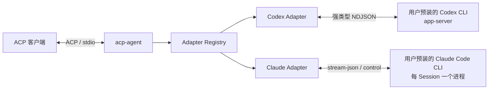

# acp-go

`acp-go` 是一个基于 [Agent Client Protocol（ACP）](https://agentclientprotocol.com/) 的 stdio Agent 服务，用来把支持 ACP 的客户端连接到本机 Agent CLI。

当前 V1 提供 Codex 与 Claude Adapter：Codex 使用用户本机已安装的 [OpenAI Codex CLI](https://github.com/openai/codex) `app-server`；Claude 使用用户本机已安装且已登录的 [Claude Code CLI](https://docs.anthropic.com/en/docs/claude-code)，由每个 ACP Session 独立持有一个 stream-json 进程。

> `codex` 始终是默认 Adapter；只有显式传入 `--adapter claude` 才会探测和构造 Claude。

## Codex 支持情况

### 已支持

| 类别 | ACP 能力 | 当前行为 | 使用说明 |
| --- | --- | --- | --- |
| 启动 | 默认或显式选择 Codex Adapter | `acp-agent` 和 `acp-agent --adapter codex` 都会启动 Codex Adapter | 未知 Adapter 会在建立 ACP 连接前返回错误 |
| 初始化 | `initialize` | 返回 V1 实际支持的会话、认证、配置和扩展能力 | 协议消息只通过 stdout 传输，诊断信息写入 stderr |
| 认证 | API Key | 支持从 ACP 请求、`CODEX_API_KEY` 或 `OPENAI_API_KEY` 读取凭据 | 不会把 API Key 写入日志或错误信息 |
| 认证 | ChatGPT 浏览器登录 | 支持打开系统浏览器完成 Codex 登录 | 设置 `NO_BROWSER` 后不向客户端展示该认证方式 |
| 认证 | Logout | 支持退出当前 Codex 账号 | 不会自动修改其他 Codex 配置 |
| 会话 | New Session | 创建新的 Codex Thread | 会同时返回可用模型、推理强度和运行模式 |
| 会话 | Load Session | 加载已有 Codex Thread，并回放 V1 可识别的历史内容和工具事件 | 不支持的历史事件会被安全忽略 |
| 会话 | Resume Session | 恢复已有 Codex Thread 并继续对话 | 恢复后仍可修改模型、推理强度和模式 |
| 会话 | Close Session | 关闭本地会话并取消其活动任务 | Adapter 退出时也会统一清理会话和子进程 |
| 对话 | 多轮 Prompt | 同一会话可以连续发送多轮请求 | 每个会话同一时间只运行一个前台 Prompt |
| 对话 | Cancel / Interrupt | 支持取消待启动或正在运行的 Prompt | 已经获得 Turn ID 时会向 Codex 发送 interrupt |
| 对话 | `_session/steering` | 支持活动 Turn steering；没有活动 Turn 时按 Codex 规则发起新 Turn | 同一会话内按到达顺序处理，单次失败不阻塞后续请求 |
| 输入 | Text | 直接转换为 Codex 文本输入 | 支持多个内容块组合 |
| 输入 | Image | 支持 HTTP、HTTPS、data URL 和 ACP 内联 Base64 图片 | URI 格式不受支持时会回退使用内联数据 |
| 输入 | Embedded Resource | 文本资源转为上下文；图片资源转为图片；其他二进制资源以 Base64 上下文传递 | 资源内容由 ACP 客户端提供 |
| 输入 | Resource Link | 转为 Codex 可理解的资源引用文本 | `file://` 链接会保留文件名和 URI |
| 输出 | Agent Message / Reasoning | 流式映射消息与思考增量 | 旧 Turn 或失效会话的迟到事件不会发送给客户端 |
| 输出 | Plan / Token Usage | 映射基础计划状态和上下文 Token Usage | 实验性的 Plan Delta 不在 V1 范围内 |
| 工具 | Command Execution | 映射开始、终端输出增量和完成状态 | Tool Call ID 在完整生命周期内保持一致 |
| 工具 | File Change | 映射文件新增、删除、修改、移动和补丁更新 | 在 ACP 可表达范围内保留路径与 diff |
| MCP | Server 配置 | 接收会话请求中的 stdio、Streamable HTTP MCP Server，并注入 Codex 会话 | 同名 Codex 用户/项目配置默认优先，SSE 与 MCP-over-ACP 暂不支持 |
| MCP | 启动状态 | 接收 Codex MCP Server 启动状态；失败或取消会显示为失败工具项 | Ready 状态不额外产生消息，避免干扰正常对话 |
| MCP | Tool Call | 映射 Codex 产生的 MCP 工具开始、进度和完成事件 | 输入、结果、错误和 MCP 身份会在 ACP 可表达范围内保留 |
| MCP | Elicitation | 支持 MCP 标准 Form、URL 交互，并在 URL 请求完成后通知客户端 | 客户端未声明相应 Elicitation 能力时回退到 Allow / Decline 权限交互 |
| 客户端交互 | `item/tool/requestUserInput` | 转为 ACP Form Elicitation，支持选项、自定义答案、密文提示和自动超时 | 客户端必须在 initialize 中声明 Form Elicitation；否则返回安全空答案 |
| 审批 | Command / File Change / Permissions | 映射为 ACP `session/requestPermission` 并把选择回传 Codex | 取消、异常、非法选择或过期审批统一拒绝 |
| 配置 | Model | 使用 Codex 返回的模型列表供客户端选择 | 未知模型不会静默回退 |
| 配置 | Reasoning Effort | 根据当前模型展示并校验可用推理强度 | 切换模型时会自动选择该模型支持的强度 |
| 配置 | Agent Mode | 支持 `read-only`、`agent`、`agent-full-access` | 三种模式对应不同审批、文件和网络权限 |
| 兼容 | 未识别的 Codex Notification | 记录安全摘要后忽略 | 不记录原始 Prompt、响应或认证数据 |

### 暂未支持

| 类别 | 暂未支持的能力 | 当前表现 | 后续扩展方向 |
| --- | --- | --- | --- |
| 会话 | `session/list` | 返回 ACP `MethodNotFound` | 增加会话目录与分页映射后可开放 |
| 会话 | Thread fork、archive、delete、rename、rollback 等高级管理 | 不向 ACP 客户端声明这些能力 | 需要明确 ACP 标准能力或项目扩展方法 |
| 输入 | Audio | 请求会明确失败，不会静默丢弃 | 需要同时定义 ACP 能力声明与 Codex 音频映射 |
| Codex 控制 | Review、Goal、boolean fast-mode、JetBrains AIR | V1 不声明也不调用 | 需要独立确认用户交互和 ACP 表达方式 |
| 实时能力 | Realtime、实时音频和远程控制 | V1 不生成、不声明相关实验协议 | 等上游稳定后再评估接入 |
| MCP transport | SSE、MCP-over-ACP | 会话创建或恢复时返回明确错误 | Codex app-server 支持对应 transport 后再开放能力声明 |
| MCP 管理 | OAuth 状态、资源读取和独立管理接口 | 不通过 ACP 暴露这些 Codex 管理接口 | 可按具体客户端需求分阶段增加 |
| 客户端工具 | Codex 请求客户端执行动态工具 | V1 不处理 `item/tool/call`；它不是 `requestUserInput` | 需要定义工具注册、参数 Schema、结果和取消协议 |
| Codex 生态 | Apps、Plugins、Skills、Marketplace 管理 | 不通过 ACP 暴露 | 更适合作为独立管理能力按需接入 |
| 多 Agent | Codex 多 Agent 协作控制与 UI | V1 不声明相关能力 | 需要先确定 ACP 会话、子 Agent 和状态展示模型 |
| 实验协议 | 其他实验方法或字段 | 除已明确接入的 `item/tool/requestUserInput` 外，实验 surface 仍被排除或忽略 | 上游稳定且产品范围确认后再纳入 |
| 安装更新 | 自动安装或升级 Codex CLI | 找不到 Codex 时直接返回可诊断错误 | 继续由用户或系统包管理器维护 Codex |

## Claude 支持情况

Claude Adapter 支持 new/load/resume/close、多轮 FIFO Prompt、cancel、`_session/steering`、文本/图片/资源输入、工具与权限映射、计划与 usage、model/effort/fast/mode 配置、additional directories，以及客户端 stdio/HTTP/SSE MCP。

Claude V1 不实现 session list/fork/delete、认证/登出、terminal、elicitation、providers、goal 和 Audio 输入。固定版本、协议声明、fixture、Go 文件映射及完整能力边界统一记录在 [`UPSTREAM.md`](UPSTREAM.md)。

## 对接流程



对接只需要完成三件事：

1. 在运行 ACP 客户端的机器上安装所需的 Codex 或 Claude CLI，并完成登录。
2. 构建 `acp-agent`。
3. 在 ACP 客户端中把 `acp-agent` 配置为一个 stdio Agent 命令。

## 安装准备

### 1. 安装并检查 Codex

项目使用用户本机已经安装的 Codex CLI。先确认命令可用：

```sh
codex --version
codex login status
```

当前 V1 的验证基线是 Codex CLI `0.148.0`。检测到其他可识别版本时，Adapter 会在 stderr 输出兼容性警告，然后继续尝试连接。

### 2. 安装并检查 Claude

使用 Claude Adapter 时，需要由用户自行安装并登录 Claude Code CLI：

```sh
claude --version
```

版本探测只用于 stderr 诊断，不作为硬性兼容门槛。项目不会下载、捆绑、更新 CLI，也不会修改用户的登录状态。

### 3. 构建 acp-agent

构建要求以 [`go.mod`](go.mod) 中声明的 Go 版本为准，当前为 Go `1.25.8`。

```sh
git clone https://github.com/JieWaZi/acp-go.git
cd acp-go
go build -o ./acp-agent ./cmd/acp-agent
```

构建和运行已提交代码不需要 Node.js 或 npm。

## 配置 ACP 客户端

不同 ACP 客户端的配置文件格式可能不同，但都需要提供同样的启动信息：

| 配置项 | 必需 | 值 |
| --- | --- | --- |
| Command | 是 | `acp-agent` 的绝对路径 |
| Arguments | 否 | Codex 可省略或使用 `--adapter codex`；Claude 必须使用 `--adapter claude` |
| Working Directory | 建议 | 用户希望 Agent 操作的项目目录 |
| `CODEX_PATH` | 否 | Codex CLI 的绝对路径；不设置时从客户端进程的 `PATH` 查找 |
| `CLAUDE_CODE_EXECUTABLE` | 否 | Claude CLI 的绝对路径；不设置时从客户端进程的 `PATH` 查找 |
| 认证环境变量 | 否 | 按需要设置 `CODEX_API_KEY`、`OPENAI_API_KEY` 或 `NO_BROWSER` |

Codex 配置示例：

```json
{
  "command": "/absolute/path/to/acp-go/acp-agent",
  "args": ["--adapter", "codex"],
  "cwd": "/absolute/path/to/your/project",
  "env": {
    "CODEX_PATH": "/absolute/path/to/codex"
  }
}
```

如果 Codex 已经位于 ACP 客户端进程的 `PATH` 中，可以删除整个 `env` 配置：

```json
{
  "command": "/absolute/path/to/acp-go/acp-agent",
  "args": ["--adapter", "codex"],
  "cwd": "/absolute/path/to/your/project"
}
```

Claude 客户端配置使用 `"args": ["--adapter", "claude"]`；如果 `claude` 已在 `PATH` 中无需设置环境变量，否则可设置 `CLAUDE_CODE_EXECUTABLE`：

```json
{
  "command": "/absolute/path/to/acp-go/acp-agent",
  "args": ["--adapter", "claude"],
  "cwd": "/absolute/path/to/your/project",
  "env": {
    "CLAUDE_CODE_EXECUTABLE": "/absolute/path/to/claude"
  }
}
```

`acp-agent` 是 stdio 服务。直接在终端运行时，它会等待 ACP 客户端通过 stdin 发送协议消息；这不是卡死。

## MCP 对接

ACP 客户端在创建、加载或恢复会话时，通过标准 `mcpServers` 字段传入该会话需要的 MCP Server。例如：

```json
{
  "cwd": "/absolute/path/to/your/project",
  "mcpServers": [
    {
      "name": "local-tools",
      "command": "npx",
      "args": ["-y", "@example/local-mcp"],
      "env": [{ "name": "EXAMPLE_TOKEN", "value": "from-secret-store" }]
    },
    {
      "name": "remote-tools",
      "type": "http",
      "url": "https://mcp.example.com/mcp",
      "headers": [{ "name": "Authorization", "value": "Bearer from-secret-store" }]
    }
  ]
}
```

使用时需要注意：

- Codex 支持 stdio 和 Streamable HTTP；Claude 支持 stdio、HTTP 和 SSE；MCP-over-ACP 不在当前 V1 范围内。
- Server 名称中的空白会转换为 `_`，例如 `local tools` 会成为 `local_tools`。
- 如果 Codex 用户配置或项目配置已经存在同名 Server，默认继续使用已有配置，避免不同 transport 被错误合并。
- `DISABLE_MCP_CONFIG_FILTERING=true` 可以关闭同名保护；仅在明确需要让会话配置参与 Codex 合并时使用。
- MCP 凭据由 ACP 客户端传入，`acp-agent` 不会替用户写入 Codex 配置文件。

如果客户端希望展示 MCP 表单、打开认证 URL，或支持 Codex 在工具执行中询问用户，需要在 `initialize` 的客户端能力中声明：

```json
{
  "clientCapabilities": {
    "elicitation": {
      "form": {},
      "url": {}
    }
  }
}
```

`form` 用于 MCP 表单和 `item/tool/requestUserInput`，`url` 用于 MCP URL 交互。MCP Elicitation 在能力缺失时仍可回退为权限选择；`requestUserInput` 在缺少 `form` 时返回空答案，不会让请求永久挂起。

## 认证配置

### ChatGPT 登录

默认情况下，ACP 客户端会看到 `ChatGPT` 认证方式。选择后，`acp-agent` 会调用系统浏览器完成登录。

无图形界面的服务器可以设置：

```json
{
  "env": {
    "NO_BROWSER": "1"
  }
}
```

任意非空的 `NO_BROWSER` 都会隐藏 ChatGPT 浏览器认证入口。

### API Key

可以由 ACP 客户端在认证请求中提供 API Key，也可以通过环境变量传入：

```json
{
  "env": {
    "CODEX_API_KEY": "your-api-key"
  }
}
```

API Key 的选择顺序如下，找到第一个非空值后停止：

1. ACP 认证请求中的 `_meta.api-key.apiKey`
2. `CODEX_API_KEY`
3. `OPENAI_API_KEY`

建议让 ACP 客户端或系统密钥管理工具注入环境变量，不要把真实密钥提交到项目配置中。

## 运行模式

客户端创建或恢复会话后，可以选择以下模式：

| 模式 | 文件权限 | 命令与审批 | 网络 |
| --- | --- | --- | --- |
| `read-only` | 只读 | 编辑文件和运行命令需要审批 | 默认禁用 |
| `agent` | 可写当前工作区 | 按需审批 | 默认禁用 |
| `agent-full-access` | 可访问工作区外路径 | 默认不要求审批，请谨慎使用 | 允许访问 |

模型和推理强度来自当前 Codex 返回的可用目录，因此具体选项会随 Codex 安装和账号能力变化。

## 常见问题

| 现象 | 原因与处理方式 |
| --- | --- |
| 提示找不到 Codex | 确认 ACP 客户端进程的 `PATH` 包含 `codex`，或显式设置正确的 `CODEX_PATH` |
| 设置了 `CODEX_PATH` 后仍启动失败 | 非空 `CODEX_PATH` 无效时不会回退到 `PATH`；请修正或删除该变量 |
| 显示 Codex 版本兼容性警告 | 当前版本不是验证基线 `0.148.0`；Adapter 会继续尝试运行，但建议先验证核心会话流程 |
| 看不到 ChatGPT 登录方式 | 检查 `NO_BROWSER` 是否被设置为非空值 |
| API Key 认证失败 | 检查 ACP 请求、`CODEX_API_KEY`、`OPENAI_API_KEY` 的优先级和实际注入环境 |
| 直接运行后没有输出 | `acp-agent` 正在等待 ACP 客户端通过 stdin 发起 initialize，这是 stdio Agent 的正常行为 |
| 客户端收不到合法协议消息 | 确认客户端没有把 stderr 合并到 stdout；stdout 必须只承载 ACP 协议帧 |
| MCP Server 没有使用会话中的新配置 | 检查 Codex 用户/项目配置中是否已有清洗后的同名 Server；默认已有配置优先 |
| 看不到 MCP 表单或结构化提问 | 确认客户端在 initialize 中声明了 `clientCapabilities.elicitation.form`；URL 交互还需要声明 `url` |
| 客户端请求了未支持能力 | 对照上面的“暂未支持”表；未声明的 ACP 方法通常返回 `MethodNotFound` 或明确的参数错误 |
| 提示找不到 Claude | 确认 ACP 客户端进程的 `PATH` 包含 `claude`，或显式设置正确的 `CLAUDE_CODE_EXECUTABLE` |
| Claude load 找不到历史 | 检查 `CLAUDE_CONFIG_DIR`；历史回放会从其 `projects` 子目录安全定位 transcript |

## 开发与维护资料

根 README 只说明安装、能力和客户端对接。开发、测试及上游协议同步请阅读：

| 路径 | 职责 |
| --- | --- |
| [`cmd/acp-agent`](cmd/acp-agent) | 命令行入口、进程 stdio 边界和 Adapter 组合根。 |
| [`internal/acpserver`](internal/acpserver) | 使用 ACP SDK 建立 Agent 侧连接，并管理 Adapter 的有界关闭。 |
| [`internal/core`](internal/core) | 与具体实现无关的 Adapter 注册和选择。 |
| [`internal/codex`](internal/codex) | Codex app-server 到 ACP 的运行时适配。 |
| [`agents/codex/protocol`](agents/codex/protocol) | Codex app-server Schema、生成 DTO 和受控 Envelope。 |
| [`internal/claude`](internal/claude) | Claude per-session 进程、Session、事件、权限与配置适配。 |
| [`agents/claude/protocol`](agents/claude/protocol) | Claude stream-json/control 窄类型与冻结 fixture。 |
| [`tools/protocolgen`](tools/protocolgen) | 固定工具链下的协议生成、新鲜度和稳定面检查。 |
| [`UPSTREAM.md`](UPSTREAM.md) | 上游版本、源码映射、Fixture 对照和已知差异。 |
| [`docs/V1_TEST_MATRIX.md`](docs/V1_TEST_MATRIX.md) | V1 能力对应的默认测试与真实 Codex 测试矩阵。 |
| [`docs/CLAUDE_V1_TEST_MATRIX.md`](docs/CLAUDE_V1_TEST_MATRIX.md) | Claude V1 fake CLI 证据与真实 CLI smoke 边界。 |

## 开发与验证

默认测试使用可控的 fake app-server 和 fake Claude CLI，不需要账号凭据，也不会产生模型费用：

```sh
go test ./... -count=1 -timeout=300s
go vet ./...
go run ./tools/protocolgen --check
```

涉及并发、生命周期或协议边界的变更，还应运行竞态检查：

```sh
go test -race -p=1 ./... -count=1 -timeout=600s
```

真实 Codex Smoke Test 和完整 V1 场景见 [`docs/V1_TEST_MATRIX.md`](docs/V1_TEST_MATRIX.md)；Claude 的真实 CLI smoke 边界见 [`docs/CLAUDE_V1_TEST_MATRIX.md`](docs/CLAUDE_V1_TEST_MATRIX.md)。两者都是显式开启的本机状态/潜在付费测试。

## 协议同步

Codex app-server 的稳定 Schema、生成工具和参考实现版本均已固定。不要手工修改 `agents/codex/protocol/generated_protocol.go`。

```sh
# 从已提交 Schema 重新生成 Go 类型
go generate ./agents/codex/protocol

# 检查已提交产物是否与固定输入一致
go run ./tools/protocolgen --check

# 刷新 Codex Schema 并重新生成；需要 Node.js/npm
go run ./tools/protocolgen --refresh-schema
```

升级上游或扩大 V1 协议面前，请先阅读 [`UPSTREAM.md`](UPSTREAM.md)，并同步更新源码映射、Fixture 证据和测试。

## V1 边界

- 默认 Adapter 是 `codex`；Claude 只能通过 `--adapter claude` 显式选择。
- 项目不捆绑、下载或自动安装 Codex/Claude CLI，也不修改用户的登录状态。
- Claude V1 不实现 session list/fork/delete、认证/登出、terminal、elicitation、providers、goal 和 Audio 输入；完整清单见 [`UPSTREAM.md`](UPSTREAM.md)。
- Codex V1 会映射已产生的 MCP 工具事件；Claude V1 还会把客户端 stdio/HTTP/SSE MCP 配置传给该 Session 的 CLI。
