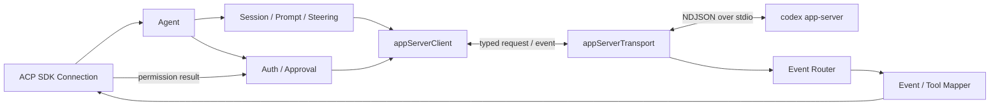

# Codex Adapter

`internal/codex` 是 `acp-go` 的 Codex 运行时适配层。它实现 ACP SDK 的 Agent 生命周期，将外层 ACP 会话和请求转换为 Codex app-server 调用，再把 Codex 通知、工具事件与审批请求映射回 ACP。

本文面向维护 Adapter 的开发者。项目定位、安装、启动和通用开发命令见 [项目根 README](../../README.md)；Codex Schema 固定点、TypeScript 对照和 Fixture 证据见 [`UPSTREAM.md`](../../UPSTREAM.md)。

## 职责边界

本目录负责：

- 查找并验证用户预装的 Codex CLI，维护唯一 `codex app-server` 子进程。
- 实现 ACP initialize、认证、会话、Prompt、取消、配置和 steering 生命周期。
- 管理 ACP Session ID、Codex Thread ID、Turn ID 与本地 generation 的一致性。
- 将 Codex 消息、推理、计划、Usage 和工具生命周期映射为 ACP `session/update`。
- 将 Codex 的命令、文件和细粒度权限请求映射为 ACP permission request。
- 在进程退出、协议错误、并发取消和关闭场景中释放 pending 请求与后台任务。

本目录不负责：

- ACP stdio 连接和顶层进程组合；它们属于 `internal/acpserver` 与 `cmd/acp-agent`。
- Adapter 注册和选择；它们属于 `internal/core`。
- 定义或手写 Codex wire DTO；稳定类型位于 [`agents/codex/protocol`](../../agents/codex/protocol)，其中生成文件禁止手改。
- 安装、下载或更新 Codex CLI。

## 调用链



启动时的关键顺序如下：

1. `NewAgent` 按 `CODEX_PATH` → `PATH` 解析 Codex，并通过 `codex --version` 完成有界版本探测。
2. Adapter 启动唯一 `codex app-server`，建立 NDJSON transport 和强类型 client。
3. `internal/acpserver` 创建 ACP SDK connection 后，通过 `SetAgentConnection` 注入事件更新与审批回调通道。
4. ACP `initialize` 成功完成 app-server `initialize`/`initialized` 握手后，Adapter 才发布实际支持的能力。
5. `Close` 依次终止 steering、Session/Prompt、transport 和子进程；该操作幂等且由外层有界调用。

## ACP 与 Codex 映射

| ACP 能力 | Codex app-server 行为 |
| --- | --- |
| `initialize` | `initialize` 后发送 `initialized`，并读取客户端终端输出能力。 |
| `authenticate` / `logout` | API Key 或 ChatGPT `account/*` 流程；登录完成通知始终先订阅后发起请求。 |
| `session/new` | `thread/start`，随后读取模型目录并建立 Session 配置快照。 |
| `session/resume` | `thread/resume` 并重新安装受 generation 保护的 Session。 |
| `session/load` | `thread/resume` → `thread/read(includeTurns=true)`，再通过现有 Mapper 回放历史。 |
| `session/close` | 提升 generation、取消活动 Prompt、`thread/unsubscribe`。 |
| `session/prompt` | 转换内容后执行 `turn/start`，流式转发事件并等待精确 Turn 完成。 |
| `session/cancel` | 取消 pending/active Prompt；已知 Turn 时最多发送一次 `turn/interrupt`。 |
| `session/set_mode` / `session/set_config_option` | 更新当前 Session 的审批、沙箱、模型和推理强度快照。 |
| `_session/steering` | 每个 Session 使用有界 FIFO；活动 Turn 走 `turn/steer`，否则回退为新 Turn。 |
| permission request | 映射 command、file change、permissions 三类审批，并把选择转换回强类型响应。 |

V1 不实现 `session/list`；Audio 输入会被明确拒绝。MCP 只负责映射 Codex 已产生的工具调用事件，不管理客户端提供的 MCP Server。

## 关键不变量

### 身份与并发

- ACP Session ID 与 Codex Thread ID 使用同一稳定值；每次 open、close 和 reopen 由递增 generation 隔离。
- 每个通知在外发前都校验 Thread、Turn 和 generation。旧 Turn、迟到响应和已关闭 Session 的事件不得写回客户端。
- `turn/start` 响应中的 Turn 身份必须在 transport 继续读取后续帧前同步安装，以覆盖“完成通知早于调用方收到 start 响应”的时序。
- 一个 Session 同时只拥有一个活动前台 Prompt；取消 start 中的 Prompt 后仍会观察迟到 Turn，并执行至多一次 interrupt。
- Steering 按 Session 串行消费，默认最多等待 64 项；单项非协议失败不会阻塞后续请求。

### 安全与资源边界

- ACP 协议只写外层 `stdout`；Codex stderr、版本警告和运行时诊断只进入 logger/`stderr`。
- API Key 不得进入日志、错误包装或测试快照。认证请求的凭据优先级为 request meta、`CODEX_API_KEY`、`OPENAI_API_KEY`。
- 审批处理在缺少 connection、取消、异常、非法选项或 generation 失效时必须 fail closed。
- app-server transport 默认限制单帧为 8 MiB，同时处理的 server request 上限为 16。
- Adapter 只拥有一个 app-server 进程；关闭路径必须幂等，并保留独立的 5 秒资源清理窗口。
- 未识别通知只记录 method、identity 和 payload 大小等安全摘要，不记录原始 payload。

## 文件导航

| 文件 | 主要职责 |
| --- | --- |
| `agent.go` | ACP Agent 入口、依赖装配、初始化、Session/Prompt/取消与关闭主链。 |
| `executable.go`、`process.go` | Codex 路径、版本探测、唯一 app-server 进程与 stderr/退出状态。 |
| `appserver_transport.go` | 无 `jsonrpc` 字段的 NDJSON 读写、pending 配对、server request 并发和 fatal fan-out。 |
| `appserver_client.go` | 基于生成 DTO 的 typed request、通知订阅、Turn waiter 和账号操作。 |
| `session.go`、`prompt.go`、`steering.go` | generation/close fence、活动 Prompt 生命周期和每 Session FIFO steering。 |
| `auth.go`、`browser.go` | API Key、ChatGPT 登录、取消流程和系统浏览器薄适配。 |
| `approval.go`、`approval_runtime.go` | 三类审批的 ACP option、Codex decision 与 stale fail-closed 检查。 |
| `config.go` | 模型、推理强度以及三种审批/沙箱模式。 |
| `content.go` | ACP Text、Image、Resource、ResourceLink 到 Codex `UserInput` 的转换。 |
| `event_router.go`、`notification.go` | 通知的强类型分派、身份过滤和 Agent 级通知接线。 |
| `event_handler.go`、`tool_mapper.go` | 消息、推理、计划、Usage、命令、文件、MCP 和终端事件映射。 |
| `history.go` | 已有 Thread 的历史内容和工具事件回放。 |
| `terminal_output_mode.go` | ACP 客户端 `terminal_output`/legacy delta 能力协商。 |

同名 `*_test.go` 通常与实现文件保持职责对应；跨层生产组合测试位于 `cmd/acp-agent`。

## 协议类型与上游

Adapter 的 Codex wire 类型来自固定的 Codex `0.148.0` 默认稳定 JSON Schema。当前 TypeScript 行为参考是 `@agentclientprotocol/codex-acp` `1.6.2`；精确提交、Schema 哈希、类型根和逐文件映射由 [`UPSTREAM.md`](../../UPSTREAM.md) 维护。

已知方法必须使用 `protocol` 包的强类型 Envelope、DTO 和 method 常量。不要为方便在本目录重复声明 wire struct，也不要把已知协议降级为通用 `map[string]any`。

```sh
# 只检查生成产物，无文件修改
go run ./tools/protocolgen --check

# 从已提交 Schema 重新生成
go generate ./agents/codex/protocol

# 刷新 Schema 并生成；需要 Node.js/npm
go run ./tools/protocolgen --refresh-schema
```

增加 app-server 方法或通知时，通常需要同步完成以下工作：

1. 在 `agents/codex/protocol/schema/protocol.root.json` 纳入必要的稳定类型根。
2. 重新生成协议类型，并在受控 Envelope 中绑定 method 与 Params。
3. 在 `appserver_client`、通知/审批路由和 ACP Mapper 中接线。
4. 增加 wire 往返、Fixture 映射、运行时行为及 stale/取消路径测试。
5. 更新 [`UPSTREAM.md`](../../UPSTREAM.md) 中的源码与 Fixture 对照。

## 测试

日常修改至少运行目标包测试和协议新鲜度检查：

```sh
go test ./internal/codex -count=1
go run ./tools/protocolgen --check
```

涉及 transport、Session、Prompt、审批、steering 或关闭时序时，运行完整测试和竞态检查：

```sh
go test ./... -count=1 -timeout=300s
go test -race -p=1 ./... -count=1 -timeout=600s
go vet ./...
```

真实 Codex 测试不会默认执行。Smoke Test、完整 V1 场景、凭据和模型费用边界见 [`docs/V1_TEST_MATRIX.md`](../../docs/V1_TEST_MATRIX.md)。

## 维护约定

- 优先保持与固定上游的行为一致；必要的 Go 等价改写或安全加固必须记录到 `UPSTREAM.md`。
- 新增依赖优先使用消费方小接口和显式注入，避免再抽象一套覆盖全部运行时的大接口。
- 手写 Go 声明使用有意义的中文注释；生成代码由生成标记豁免。
- 日志只保留诊断所需的最小安全信息，尤其不要输出认证数据或未知事件原文。
- 修改生命周期或并发路径时，必须覆盖成功、取消、迟到、stale、进程退出和重复关闭等边界。
