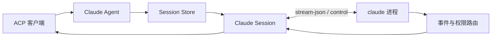

# Claude Adapter

`pkg/claude` 是可公开导入的 Claude ACP Adapter。它为每个 ACP Session 启动一个 Claude Code CLI stream-json 进程，并把消息、工具事件、权限请求和配置变化发送回 ACP 客户端。

项目安装、CLI 启动和通用维护命令见[根 README](../../README.md)。协议版本、源码映射、fixture 与升级步骤见 [`UPSTREAM.md`](UPSTREAM.md)。

## 定位与职责

本包负责：

- 查找并验证用户安装的 Claude Code CLI。
- 为每个 New、Load 或 Resume Session 创建独立 CLI 进程和 control transport。
- 实现 FIFO Prompt、取消、close 与 `_session/steering`。
- 映射 Assistant Message、内置/MCP Tool、Task Plan、Usage 和权限交互。
- 把内置 `AskUserQuestion` 转换为客户端协商的 ACP Form Elicitation。
- 把 Model、Effort、Fast Mode 与权限模式表示为 ACP Session 配置。
- 转换 additional directories 和 stdio、HTTP、SSE MCP Server 配置。
- 从本机 Claude 配置目录读取并安全回放可识别的 Session 历史。

本包不负责 ACP stdio 服务与 Adapter 选择；这些职责位于 `pkg/acpserver` 和 `cmd/acp-agent`。

## 能力范围

支持的主要能力：

- New、Load、Resume、Close Session 与历史回放。
- 多轮 FIFO Prompt、Text、Image、Embedded Resource 和 Resource Link。
- Prompt cancel 与 `_session/steering`；空闲 Session 可启动 detached Turn 或要求客户端改用 Prompt。
- Assistant、Tool Start/Progress/Result、Task Plan 与 Usage 更新；Task、文件、搜索、Web、Skill 和 AskUserQuestion 按 upstream 生成结构化 ACP 工具信息。
- Agent SDK `assistant.error` 与 `result.is_error` 按 upstream 转为 ACP Provider 错误，保留开放 `errorKind`；login 使用标准 AuthRequired，不把 API Error 当成功回复。
- New、Load、Resume 后发布 Claude SDK 权威 Slash Command，并在 `commands_changed` 时通过 ACP 标准通知完整替换；过滤本地终端命令并保留 MCP 名称和参数提示。
- 全部 ToolCall 携带 upstream `claudeCode.toolName`；Skill 额外携带名称和可定位时的项目、目录作用域、插件或用户级 `SKILL.md` 路径。
- Edit/Write 开始态标准 ACP diff，以及唯一 tool result 携带 `filePath/structuredPatch` 时的多 hunk 完成态 diff 和 locations 修正。
- `can_use_tool` 权限请求和安全拒绝。
- `AskUserQuestion` Form Elicitation，支持单选、多选、每题自定义答案和取消。
- stdio、HTTP、SSE MCP Server 与 additional directories。
- Model、Effort、Fast Mode 和受控权限模式；符合安全门槛时提供 `bypassPermissions`。

不支持的主要能力：

- `session/list`、fork、delete 等会话管理。
- ACP 认证/登出、terminal、MCP Elicitation、provider 和 goal。
- Audio 与 MCP-over-ACP transport。

## 调用链



每个 Session 拥有独立进程、transport、Prompt 队列和活动 Turn 身份。一个 Session 的失败不会复用或污染其他 Session 的运行时状态。

## 配置

公开入口：

```go
agent, err := claude.NewAgent(ctx, claude.Config{
    Logger:      logger,
    ClaudePath:  explicitPath,
    PrefixArgs:  runtimePrefixArgs,
    Environment: runtimeEnvironment,
})
```

- `Logger` 必须非空，且应写入 stderr。
- `ClaudePath` 非空时必须指向有效可执行文件；为空时才查询 `PATH`。
- `PrefixArgs` 按原顺序放在 Adapter 固有的版本探测与 Session 参数之前。
- `Environment` 是 Adapter、版本探测和全部 Session 进程使用的完整环境；`nil` 表示继承当前进程。
- `CLAUDE_CONFIG_DIR` 通过 `Environment` 指定 Claude 配置与历史 Session 目录；`IS_SANDBOX` 等 Adapter 判断也读取同一环境快照。
- Session 的工作目录必须是存在的绝对目录；additional directories 会被规范化、去重和稳定排序。
- 非 root 进程或 `IS_SANDBOX` 非空时，CLI 使用 `--allow-dangerously-skip-permissions` 启动并向客户端提供 `bypassPermissions`；root 且非沙箱时不提供。
- `AskUserQuestion` 只有在客户端于 `initialize.clientCapabilities.elicitation.form` 声明支持时才启用，否则安全拒绝工具请求。

构造成功后，调用方必须在生命周期结束时调用 `Agent.Close`；使用 `pkg/acpserver.Server` 时由 Server 负责关闭。

## 文件导航

| 路径 | 职责 |
| --- | --- |
| `agent.go` | ACP 入口、依赖装配与 Session 管理 |
| `session.go` | Prompt 队列、活动 Turn、取消和关闭状态 |
| `process.go`、`transport.go` | CLI 进程与有界 stream-json/control 通信 |
| `launch.go` | 工作目录、附加目录和 MCP 启动参数 |
| `events.go`、`permission.go`、`elicitation.go` | 消息、工具、计划、Usage、权限与结构化提问映射 |
| `config.go`、`steering.go` | Session 配置与 steering 行为 |
| `content.go`、`history.go` | 输入转换与本地历史回放 |
| [`protocol`](protocol) | stream-json/control 窄类型与冻结 fixture |
| [`UPSTREAM.md`](UPSTREAM.md) | 固定版本、追溯映射、差异与升级流程 |

## 测试

包级测试：

```sh
go test ./pkg/claude -count=1
go test ./pkg/claude/protocol -count=1
```

全仓验证和竞态检查见[根 README](../../README.md#开发与验证)，真实 CLI 边界见 [`docs/CLAUDE_V1_TEST_MATRIX.md`](../../docs/CLAUDE_V1_TEST_MATRIX.md)。默认测试使用 fake CLI 和冻结 fixture，不读取真实账号或访问网络。

## 已知边界

- 每个 Session 都有独立 CLI 进程；大量并发 Session 会直接增加本机进程和资源占用。
- 取消后的 Session 必须观察到旧 Turn 的结束边界，缺少必要尾帧时会关闭该 Session。
- 历史回放只读取受限大小的本地 transcript，并忽略无法安全表达的记录。
- 当前 CLI 边界不注入通用 PostToolUse hook；Edit/Write 没有结构化结果时保留开始态 diff，不用普通结果文本覆盖。
- Context Usage 使用顶层 assistant 的 input、output、cache read 与 cache creation 累计快照；PromptResponse Usage 单独表示当前 Prompt 的 Turn 总量，权威模型窗口由 result.modelUsage 确认并在当前 Agent 内缓存。
- Slash Command 与 Skill 元数据直接跟随固定 Claude Agent ACP/Agent SDK upstream；Adapter 不维护产品层命令或 Skill 规则。
- 本地 Session 缺失统一返回 ACP `ResourceNotFound`（`-32002`），恢复时已知的 CLI “conversation not found” 也映射为同一错误。
- 版本探测只提供诊断，不作为硬性兼容门槛。

## 维护约定

- 公开入口保持在 `pkg/claude`，协议类型保持在 `pkg/claude/protocol`。
- 手写类型、字段、函数和关键逻辑使用中文注释，且只描述当前实现。
- 版本、来源、行为映射与差异统一维护在 [`UPSTREAM.md`](UPSTREAM.md)。
- 能力变化必须同步更新本 README、测试和 [`docs/CLAUDE_V1_TEST_MATRIX.md`](../../docs/CLAUDE_V1_TEST_MATRIX.md)。
