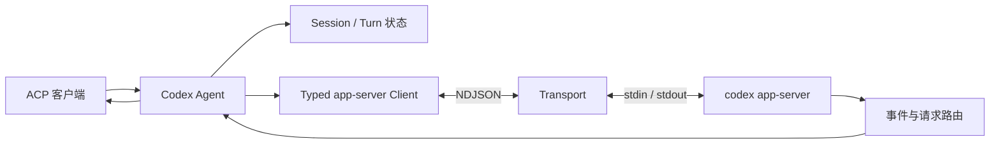

# Codex Adapter

`pkg/codex` 是可公开导入的 Codex ACP Adapter。它把 ACP Agent 生命周期转换为 Codex CLI `app-server` 请求，并把消息、工具事件、审批和配置变化发送回 ACP 客户端。

项目安装、CLI 启动和通用维护命令见[根 README](../../README.md)。协议版本、源码映射、fixture 与升级步骤见 [`UPSTREAM.md`](UPSTREAM.md)。

## 定位与职责

本包负责：

- 查找并验证用户安装的 Codex CLI，持有一个 `codex app-server` 子进程。
- 实现 initialize、认证、Session 创建/加载/恢复/关闭、Prompt、取消和 steering。
- 维护 ACP Session、Codex Thread、Turn 与本地 generation 的一致性。
- 校验 additional directories，配置 trusted projects、可写根并刷新标准 `.agents/skills`。
- 映射 Agent Message、Reasoning、Plan、Token Usage、命令、文件变更、Web Search、Image View 与 MCP Tool Call。
- 把命令、文件和细粒度权限请求转换为 ACP `session/requestPermission`。
- 在关闭、进程异常、协议错误和并发取消时释放有界队列与等待请求。

本包不负责 ACP stdio 服务与 Adapter 选择；这些职责位于 `pkg/acpserver` 和 `cmd/acp-agent`。

## 能力范围

支持的主要能力：

- API Key、ChatGPT 浏览器登录和登出。
- New、Load、Resume、Close Session 与历史回放。
- 多轮 Prompt、Text、Image、Embedded Resource 和 Resource Link。
- Prompt cancel/interrupt 与 `_session/steering`。
- Command、Web Search、Image View、MCP Tool、Plan、Reasoning 和 Usage 更新。
- File Change 的 add、delete、update 和 move 标准 ACP diff；`turn/diff/updated` 作为已知聚合通知识别，不重复生成工具调用。
- PromptResponse 级 Input/Cache/Output/Thought/Total Usage。
- additional directories、trusted projects、workspace-write roots 与工作区 Skill 刷新。
- stdio、Streamable HTTP MCP Server，以及 Form/URL Elicitation。
- Model、Reasoning Effort 和 `read-only`、`agent`、`agent-full-access` 模式。

不支持的主要能力：

- `session/list`、fork、archive、delete、rename 和 rollback。
- Audio、Review、Goal、Realtime、动态客户端工具及生态管理接口。
- SSE 与 MCP-over-ACP transport。

## 调用链



一个 Adapter 实例只启动一个 app-server。各 Session 共享 transport，但 Session generation、活动 Prompt、审批和 steering 队列相互隔离。

## 配置

公开入口：

```go
agent, err := codex.NewAgent(ctx, codex.Config{
    Logger:      logger,
    CodexPath:   explicitPath,
    PrefixArgs:  prefixArgs,
    Environment: environment,
})
```

- `Logger` 必须非空，且应写入 stderr。
- `CodexPath` 非空时必须指向有效可执行文件；为空时才查询 `PATH`。
- `PrefixArgs` 会按原顺序放在 `--version` 和 `app-server` 子命令之前。
- `Environment` 是 Adapter、版本探测和 app-server 共用的完整环境列表；`nil` 表示继承当前进程。
- `CODEX_API_KEY` 和 `OPENAI_API_KEY` 可用于 API Key 认证。
- `NO_BROWSER` 非空时隐藏浏览器登录。
- `DISABLE_MCP_CONFIG_FILTERING=true` 时关闭同名 MCP 配置保护。
- `session/new`、`load`、`resume` 的 `cwd` 与 `additionalDirectories` 必须是绝对路径；重复项和 `cwd` 会被去重。

工作区 Skill 使用 `<root>/.agents/skills/<skill-name>/SKILL.md`。存在标准 Skill 目录时，Adapter 会在 Session 打开和每次 Prompt 前更新 app-server extra roots，并使用 `skills/list(forceReload=true)` 重新扫描主目录及附加目录。

构造成功后，调用方必须在生命周期结束时调用 `Agent.Close`；使用 `pkg/acpserver.Server` 时由 Server 负责关闭。

## 文件导航

| 路径 | 职责 |
| --- | --- |
| `agent.go` | ACP 入口、依赖装配与 Session 生命周期 |
| `appserver_client.go` | typed 请求、通知与 Turn 完成关联 |
| `appserver_transport.go` | 有界 NDJSON 读写、请求关联与反向请求 |
| `session.go`、`prompt.go`、`steering.go` | Session generation、Prompt 与 steering 状态机 |
| `event_handler.go`、`tool_mapper.go`、`file_diff.go` | 消息、工具、文件 diff、计划和 Usage 映射 |
| `approval.go`、`elicitation.go` | 权限与用户交互 |
| `auth.go`、`config.go`、`mcp_config.go` | 认证、Session 配置与 MCP 转换 |
| [`protocol`](protocol) | Schema、生成 DTO、Envelope 与生成入口 |
| [`UPSTREAM.md`](UPSTREAM.md) | 固定版本、追溯映射、差异与升级流程 |

## 测试

包级测试：

```sh
go test ./pkg/codex -count=1
go test ./pkg/codex/protocol -count=1
go run ./tools/protocolgen --check
```

全仓验证和竞态检查见[根 README](../../README.md#开发与验证)，真实 CLI 场景见 [`docs/V1_TEST_MATRIX.md`](../../docs/V1_TEST_MATRIX.md)。默认测试使用 fake app-server，不读取凭据或调用模型。

## 已知边界

- app-server 进程异常会使当前 Adapter 不可用，需要由宿主重新构造。
- 本地 Session 缺失统一返回 ACP `ResourceNotFound`（`-32002`），宿主可据此决定恢复或重建。
- 客户端未声明 Elicitation 能力时，交互请求按安全默认值处理。
- 不支持的实验消息不会成为公开能力；未知通知只记录英文安全摘要，upstream 明确忽略的 hook 通知不作为未知能力记录。
- Codex CLI 版本变化可能影响运行时兼容性，升级前必须完成协议新鲜度和回归测试。

## 维护约定

- 公开入口保持在 `pkg/codex`，协议类型保持在 `pkg/codex/protocol`。
- 禁止手工修改 `protocol/generated_protocol.go`；通过 `go generate ./pkg/codex/protocol` 生成。
- 手写类型、字段、函数和关键逻辑使用中文注释，且只描述当前实现。
- 版本、来源、行为映射与差异统一维护在 [`UPSTREAM.md`](UPSTREAM.md)。
- 能力变化必须同步更新本 README、测试和 [`docs/V1_TEST_MATRIX.md`](../../docs/V1_TEST_MATRIX.md)。
